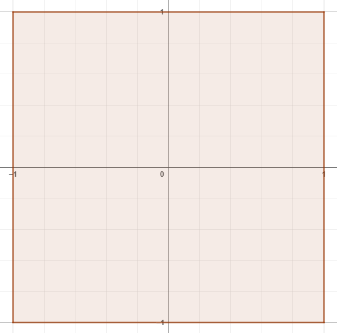
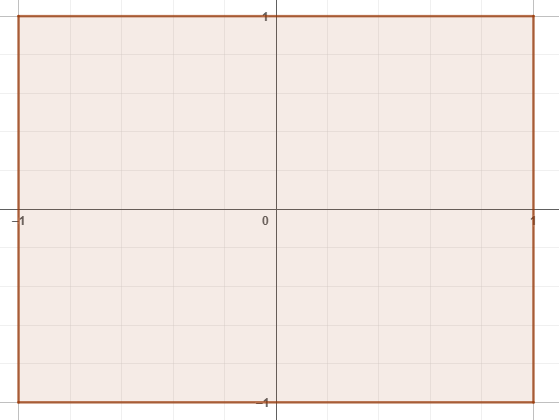
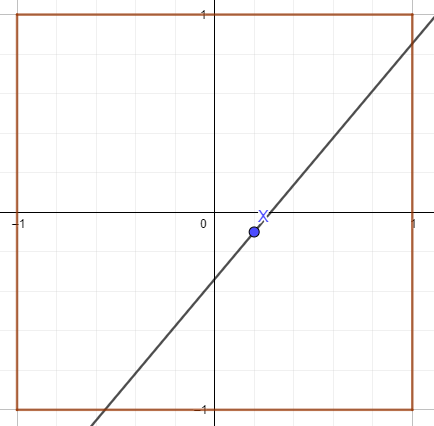
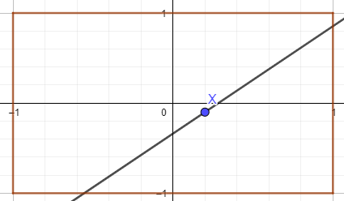

# 基本概念

## 基本单位

### 音乐延迟值 (musicOffset)

**音乐延迟值** 指定在谱面开始后多久才开始播放音乐，单位为秒。我们推荐通过剪辑音乐来避免对该属性的错用和滥用。

### 节拍 (Beat)

**节拍** 是（几乎？）所有音乐共同具有的概念。量化每分钟的节拍数的数值被称作 BPM (Beat Per Minute)。

PhiFormat 设计上支持多 BPM 的音乐。

### Tick：PhiFormat 基本时间单位

**Tick** 是 PhiFormat 中基本的时间单位。

在 PhiFormat 中，tick 为整数值，从 0 开始计算。0 tick 被视为曲目的起始（0 second）。每一拍根据 **时基 (Timing Base)** 被划分为指定数量的 tick 数。默认情况下，时基为 48。48 分能够满足绝大多数的谱面制作需求。若无更细致的节拍划分需求，**不建议** 修改时基。

!!! warning
编辑器作者请注意，您应该在编辑器中提供修改时基的选项，但应明确指出不建议修改。

### 半屏长 (Half-Screen Length, HSL)：PhiFormat 基本长度单位

**半屏长 (HSL)** 是 PhiFormat 为兼容性而自定义的长度单位。1 HSL 等同于一个屏幕的长边的一半。接下来你会很经常看到它。

## 坐标系统和判定线

!!! warning
当我们讨论这一章节的时候，我们假定你有至少高中一年级的数学知识。

### 基准坐标系和单位长度

**基准坐标系** 是用于定位判定线控制点的坐标系。

假设有一个 1:1 大小的平面，以该平面的正中心作为原点，向水平和竖直方向各引一条坐标轴作为 x, y 轴，定义单位长度为 1 HSL。这就是基准坐标系。

将这个平面 **沿 y 轴方向** 伸缩，即可伸缩至 4:3 或者 16:9 的屏幕大小。

    
    

在这个文档中,你可以将所有屏幕的比例想象成 1:1。要适配不同屏幕，只需要将它们沿 y 轴伸缩就行。

### 判定线与控制点

在一个坐标系上过一点画直线需要什么？这一点的坐标和斜率。同样的道理，在 PhiFormat 中，定义一个判定线的方法是在基准坐标系中选取一个 **控制点**，然后用这一点的坐标和旋转角来确定这条判定线。

就和你在高中数学学到的一样，我们规定：旋转角 0° 的判定线水平放置。此时朝上的面为这条判定线的“上面”，朝下的面为这条判定线的“下面”。

!!! note "为什么不用斜率？"
竖直直线的斜率不存在。

下面是一条控制点在 (0.2,-0.1)，旋转角为 50° 的判定线在三种缩放下的基准坐标系的展现：

    
    

### 判定线坐标系

规定：以一个判定线的控制点为原点，x 坐标轴沿判定线向两侧延伸，单位长度为 1 HSL 的坐标系，为判定线坐标系。

如果你接触过无轨下落式音游的自制谱，那么这个概念应该很好理解。想像一个无轨下落音游的判定线，然后把它四处移动、旋转。怎么样？

有了判定线，我们就可以讨论它的属性了。

## 判定线可变属性

在判定线构建期内可以变动的属性，统称为判定线可变属性。

### 控制点坐标 (controlX, controlY)

这两个属性定义了判定线控制点在基准坐标系的的横、纵坐标。参见 [判定线与控制点](#_5)。

### 线的旋转角 (angle)

这个属性定义了判定线的旋转角，单位为角度。参见 [判定线与控制点](#_5)。

### 速度 (speed)

这个属性定义了判定线上所有 note 的基准速度。速度的单位为 HSL/Beat。例如，当一条判定线的基准速度为 1 时，其上的 note 每拍向判定线下落距离为 1 HSL。

### 音符/判定线不透明度 (noteAlpha, lineAlpha)

这两个属性定义了音符/判定线的不透明度，取值范围为 [0,1]。1 为完全不透明，0 为完全透明。

### 显示范围 (displayRange)

这个属性定义了判定线向两侧的显示范围，单位为 HSL。例如，当显示范围为 0.5 时，note 会在判定线两侧 0.5 HSL 的位置出现并向判定线下落。当显示范围为 0 时，判定线显示范围为无限远。

## 音符属性

除了判定线，每个音符也有各自的属性。

### 类别 (type)

代表 note 的类别。

| Type | Note  |
| ---- | ----- |
| 1    | Tap   |
| 2    | Drag  |
| 3    | Hold  |
| 4    | Flick |

### x 轴位置 (x)

代表 note 在判定线坐标系相对于控制点的位置。单位为 HSL。

### 相对宽度 (width)

代表 note 相对于全局 note 宽度的宽度倍数。默认为 1。

### 相对速度 (speed)

代表 note 相对于当前判定线速度的速度倍数。默认为 1。

通常并不建议无特效需求的谱面修改。

### 下落侧 (side)

代表 note 从判定线的哪一侧。1 代表“上面”，-1 代表“下面”。

### 假 note (isFake)

代表这个 note 是否为“假 note”（又称“表演 note”）。布尔值，默认为 false。

## 缓冲 (Easing)

“缓冲”是相当常见的一种在两个状态之间渐变的状态。在 PhiFormat 中，每一个状态的 easing 属性均代表 **该状态** 到 **下一个状态** 的缓冲。

在 PhiFormat 中缓冲种类为一个整数或 null。当缓冲种类为 null 时，判定线状态将会会在 **下一个状态** 的时间处立刻更改，没有渐变过程。整数与具体缓冲类型的对应请参照规范文档。
